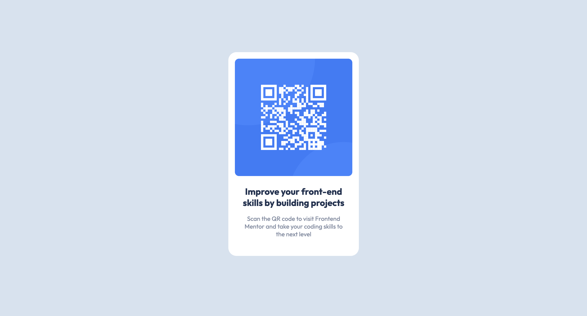

## Table of contents

- [Overview](#overview)
  - [Screenshot](#screenshot)
  - [Links](#links)
- [My process](#my-process)
  - [Built with](#built-with)
  - [What I learned](#what-i-learned)
  - [Continued development](#continued-development)

## Overview

### Screenshot



### Links

- Solution URL: [Add solution URL here](https://github.com/christinelinster/fm-qr-code)
- Live Site URL: [Add live site URL here](https://your-live-site-url.com)

## My process
- After viewing the design file, I first laid out the skeleton structure in my index html file
- I created my css file and listed out all the relevant design components including font stlyes, font sizes, colours, and the dimensions of the design 
- Starting with the higher-level components, I structured the body and container to the appropriate style then added styling to the inner elements 

### Built with

- Semantic HTML5 markup
- CSS custom properties
- Flexbox

### What I learned

This was the project I implemented using flexbox without any assistance, and is an area I need to review. During this project, I struggled with using the right properties to center-align the components and had to continuously complete a trial-and-error method. 

For example, I struggled to center the qr code container in the middle of the screen, only to discover it was because I missed setting the body element's height to 100% of the viewport. 

```css
body{
    background-color: hsl(212, 45%, 89%);
    justify-content: center;
    height: 100vh;
}
```

### Continued development

In future projects, I will place more emphasis on cleaning up and simplifying repetitive areas in my style sheet. Since this was my first project, the process I used to approach the project was not as efficient as I hoped. I will continue to learn more best practices to implement for future projects. 
